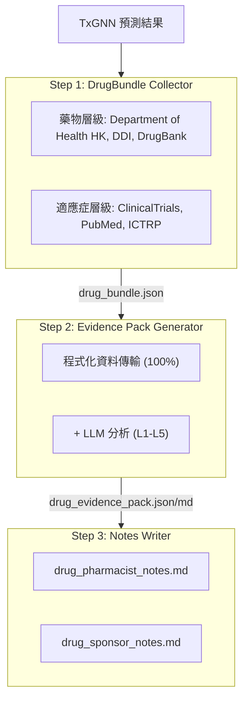
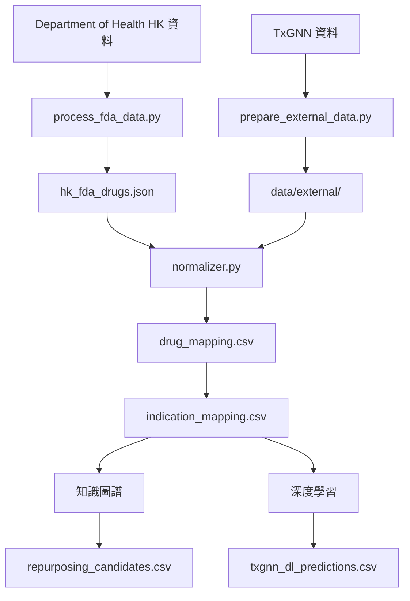

# HkTxGNN - Hong Kong: Drug Repurposing Predictions

[](https://hktxgnn.yao.care)
[](https://opensource.org/licenses/MIT)

使用 TxGNN 模型對Hong Kong Department of Health HK核准藥品進行老藥新用預測。

## 免責聲明

- 本專案結果僅供研究參考，不構成醫療建議。
- 老藥新用候選需經過臨床驗證才能應用。

## 專案成果總覽

### 驗證報告統計

| 項目 | 數量 |
|------|------|
| **藥物報告** | 1,261 |
| **總預測數** | 21,717,892 |
| **唯一藥物** | 1,261 |
| **唯一適應症** | 17,081 |
| **DDI 資料** | 302,516 |
| **DFI 資料** | 857 |
| **DHI 資料** | 35 |
| **DDSI 資料** | 8,359 |
| **FHIR 資源** | 1,261 MK / 49,524 CUD |

### 證據等級分布

| 證據等級 | 報告數 | 說明 |
|---------|-------|------|
| **L1** | 0 | 多個 Phase 3 RCT 支持 |
| **L2** | 0 | 單一 RCT 或多個 Phase 2 |
| **L3** | 0 | 觀察性研究 |
| **L4** | 0 | 前臨床/機轉研究 |
| **L5** | 1261 | 僅模型預測 |

### 按來源

| 來源 | 預測數 |
|------|------|
| KG | 18,898,931 |
| KG + DL | 2,614,650 |
| DL | 204,311 |

### 按信心度

| 信心度 | 預測數 |
|------|------|
| very_high | 118,090 |
| high | 2,621,041 |
| medium | 18,940,613 |
| low | 38,148 |

---

## 預測方法

| 方法 | 速度 | 精準度 | 環境需求 |
|------|------|--------|----------|
| 知識圖譜 | 快（幾秒） | 較低 | 無特殊需求 |
| 深度學習 | 慢（數小時） | 較高 | Conda + PyTorch + DGL |

### 知識圖譜方法

```bash
uv run python scripts/run_kg_prediction.py
```

| 指標 | 數值 |
|------|------|
| Department of Health HK 總藥品數 | 23,935 |
| 老藥新用候選數 | 21,513,581 |

### 深度學習方法

```bash
conda activate txgnn
PYTHONPATH=src python -m hktxgnn.predict.txgnn_model
```

| 指標 | 數值 |
|------|------|
| DL 總預測數 | 2,621,280 |
| 唯一藥物 | 1,261 |
| 唯一適應症 | 17,081 |

### 分數解讀

TxGNN 分數代表模型對「藥物-疾病」配對的預測信心，範圍為 0-1。

| 門檻 | 意義 |
|-----|------|
| >= 0.9 | 極高信心 |
| >= 0.7 | 高信心 |
| >= 0.5 | 中等信心 |

#### 分數分布

| 閾值 | 含義 |
|-----|------|
| ≥ 0.9999 | 極高信心度，模型最有信心的預測 |
| ≥ 0.99 | 非常高的信心度，值得優先驗證 |
| ≥ 0.9 | 高信心度 |
| ≥ 0.5 | 中等信心度（sigmoid 決策邊界） |

#### 證據等級定義

| 等級 | 定義 | 臨床意義 |
|-----|------|---------|
| L1 | 第三期隨機對照試驗或系統性回顧 | 可支持臨床使用 |
| L2 | 第二期隨機對照試驗 | 可考慮使用 |
| L3 | 第一期或觀察性研究 | 需要進一步評估 |
| L4 | 病例報告或臨床前研究 | 尚不建議 |
| L5 | 僅計算預測，無臨床證據 | 需要進一步研究 |

#### 重要提醒

1. **高分不保證臨床療效：TxGNN 分數是基於知識圖譜的預測，需要臨床試驗驗證。**
2. **低分不代表無效：模型可能未學習到某些關聯。**
3. **建議搭配驗證流程使用：使用本專案工具檢視臨床試驗、文獻及其他證據。**

### 驗證流程



---

## 快速開始

### 步驟 1: 下載資料

| 檔案 | 下載 |
|------|------|
| Department of Health HK 資料 | [資料來源](https://www.drugoffice.gov.hk/eps/psi/DrugList.xml) |
| node.csv | [Harvard Dataverse](https://dataverse.harvard.edu/api/access/datafile/7144482) |
| kg.csv | [Harvard Dataverse](https://dataverse.harvard.edu/api/access/datafile/7144484) |
| edges.csv | [Harvard Dataverse](https://dataverse.harvard.edu/api/access/datafile/7144483) |
| model_ckpt.zip | [Google Drive](https://drive.google.com/uc?id=1fxTFkjo2jvmz9k6vesDbCeucQjGRojLj) |

### 步驟 2: 安裝依賴

```bash
uv sync
```

### 步驟 3: 處理藥品資料

```bash
uv run python scripts/process_fda_data.py
```

### 步驟 4: 準備詞彙表資料

```bash
uv run python scripts/prepare_external_data.py
```

### 步驟 5: 執行知識圖譜預測

```bash
uv run python scripts/run_kg_prediction.py
```

### 步驟 6: 搭建深度學習環境

```bash
conda create -n txgnn python=3.11 -y
conda activate txgnn
pip install torch==2.2.2 torchvision==0.17.2
pip install dgl==1.1.3
pip install git+https://github.com/mims-harvard/TxGNN.git
pip install pandas tqdm pyyaml pydantic ogb
```

### 步驟 7: 執行深度學習預測

```bash
conda activate txgnn
PYTHONPATH=src python -m hktxgnn.predict.txgnn_model
```

---

## 相關資源

### TxGNN 核心

- [TxGNN Paper](https://www.nature.com/articles/s41591-024-03233-x) - Nature Medicine, 2024
- [TxGNN GitHub](https://github.com/mims-harvard/TxGNN)
- [TxGNN Explorer](http://txgnn.org)

### 資料來源

| 類別 | 資料 | 來源 | 說明 |
|------|------|------|------|
| **藥品資料** | Department of Health HK | [Department of Health HK](https://www.drugoffice.gov.hk/eps/psi/DrugList.xml) | Hong Kong |
| **知識圖譜** | TxGNN KG | [Harvard Dataverse](https://dataverse.harvard.edu/dataset.xhtml?persistentId=doi:10.7910/DVN/IXA7BM) | 17,080 diseases, 7,957 drugs |
| **藥物資料庫** | DrugBank | [DrugBank](https://go.drugbank.com/) | 藥品成分映射 |
| **藥物交互作用** | DDInter 2.0 | [DDInter](https://ddinter2.scbdd.com/) | DDI 配對 |
| **藥物交互作用** | Guide to PHARMACOLOGY | [IUPHAR/BPS](https://www.guidetopharmacology.org/) | 核准藥物交互作用 |
| **臨床試驗** | ClinicalTrials.gov | [CT.gov API v2](https://clinicaltrials.gov/data-api/api) | 臨床試驗登錄 |
| **臨床試驗** | WHO ICTRP | [ICTRP API](https://apps.who.int/trialsearch/api/v1/search) | 國際臨床試驗平台 |
| **文獻** | PubMed | [NCBI E-utilities](https://eutils.ncbi.nlm.nih.gov/entrez/eutils/) | 醫學文獻搜尋 |
| **藥名映射** | RxNorm | [RxNav API](https://rxnav.nlm.nih.gov/REST) | 藥品名稱標準化橋接 |
| **藥名映射** | PubChem | [PUG-REST API](https://pubchem.ncbi.nlm.nih.gov/docs/pug-rest) | 化學物質同義詞查詢 |
| **藥名映射** | ChEMBL | [ChEMBL API](https://www.ebi.ac.uk/chembl/api/data) | 生物活性資料庫映射 |
| **標準** | FHIR R4 | [HL7 FHIR](http://hl7.org/fhir/) | MedicationKnowledge、ClinicalUseDefinition |
| **標準** | SMART on FHIR | [SMART Health IT](https://smarthealthit.org/) | EHR 整合、OAuth 2.0 + PKCE |

### 模型與資料下載

| 檔案 | 下載 | 說明 |
|------|------|------|
| 預訓練模型 | [Google Drive](https://drive.google.com/uc?id=1fxTFkjo2jvmz9k6vesDbCeucQjGRojLj) | model_ckpt.zip |
| node.csv | [Harvard Dataverse](https://dataverse.harvard.edu/api/access/datafile/7144482) | 節點資料 |
| kg.csv | [Harvard Dataverse](https://dataverse.harvard.edu/api/access/datafile/7144484) | 知識圖譜資料 |
| edges.csv | [Harvard Dataverse](https://dataverse.harvard.edu/api/access/datafile/7144483) | 邊資料（DL 用） |

## 專案介紹

### 目錄結構

```
HkTxGNN/
├── README.md
├── CLAUDE.md
├── pyproject.toml
│
├── config/
│   └── fields.yaml
│
├── data/
│   ├── kg.csv
│   ├── node.csv
│   ├── edges.csv
│   ├── raw/
│   ├── external/
│   ├── processed/
│   │   ├── drug_mapping.csv
│   │   ├── repurposing_candidates.csv
│   │   ├── txgnn_dl_predictions.csv.gz
│   │   └── integration_stats.json
│   ├── bundles/
│   └── collected/
│
├── src/hktxgnn/
│   ├── data/
│   │   └── loader.py
│   ├── mapping/
│   │   ├── normalizer.py
│   │   ├── drugbank_mapper.py
│   │   └── disease_mapper.py
│   ├── predict/
│   │   ├── repurposing.py
│   │   └── txgnn_model.py
│   ├── collectors/
│   └── paths.py
│
├── scripts/
│   ├── process_fda_data.py
│   ├── prepare_external_data.py
│   ├── run_kg_prediction.py
│   └── integrate_predictions.py
│
├── docs/
│   ├── _drugs/
│   ├── fhir/
│   │   ├── MedicationKnowledge/
│   │   └── ClinicalUseDefinition/
│   └── smart/
│
├── model_ckpt/
└── tests/
```

**圖例**: 🔵 專案開發 | 🟢 在地資料 | 🟡 TxGNN 資料 | 🟠 驗證流程

### 資料流程



---

## 引用

如果您使用本資料集或軟體，請引用：

```bibtex
@software{hktxgnn2026,
  author       = {Yao.Care},
  title        = {HkTxGNN: Drug Repurposing Validation Reports for Hong Kong Department of Health HK Drugs},
  year         = 2026,
  publisher    = {GitHub},
  url          = {https://github.com/yao-care/HkTxGNN}
}
```

並同時引用 TxGNN 原始論文：

```bibtex
@article{huang2023txgnn,
  title={A foundation model for clinician-centered drug repurposing},
  author={Huang, Kexin and Chandak, Payal and Wang, Qianwen and Haber, Shreyas and Zitnik, Marinka},
  journal={Nature Medicine},
  year={2023},
  doi={10.1038/s41591-023-02233-x}
}
```
